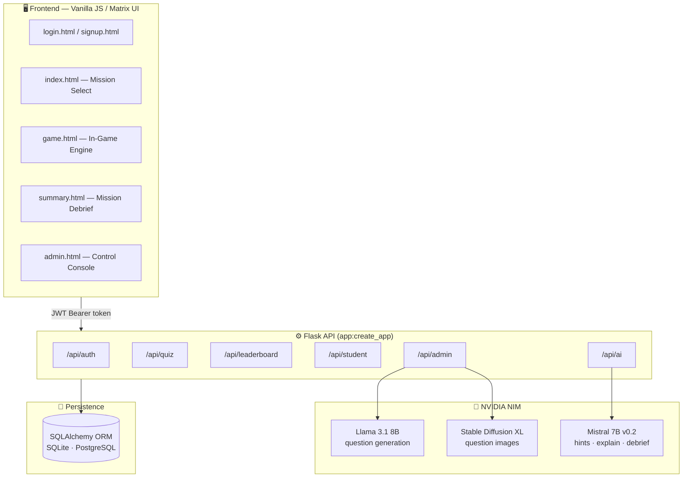

<!-- ══════════════════════════════════════════════════════════════ -->
<!--                        HERO / COVER                            -->
<!-- ══════════════════════════════════════════════════════════════ -->
<div align="center">

#  CODE ESCAPE ROOM `v2.0`

### A Matrix-themed, AI-powered cybersecurity quiz platform where players hack their way out of digital vaults — one coding puzzle at a time.

[](https://code-escape-room-kk9h.onrender.com/)
[](https://www.python.org/)
[](https://flask.palletsprojects.com/)
[](https://build.nvidia.com/)
[](https://jwt.io/)
[](https://www.sqlalchemy.org/)

<br/>


<br/>
<br/>

**[🎮 Launch the App](https://code-escape-room-kk9h.onrender.com/)** &nbsp;•&nbsp;
**[⚡ Quick Start](#-quick-start)** &nbsp;•&nbsp;
**[🧠 The AI Engine](#-the-ai-engine)** &nbsp;•&nbsp;
**[📡 API Reference](#-api-reference)**

</div>

> [!NOTE]
> The live demo is hosted on Render's free tier. If the instance has been idle it may take **~30–60 seconds to wake up** on the first request — grab a coffee, then hack away. ☕

---

## The Mission

You've been **trapped inside a rogue AI's mainframe.** The only way out is to breach a series of encrypted *vaults* — each one guarded by puzzles in a different programming language. Answer correctly to advance. Waste your lives, and the rogue AI wins.

**Code Escape Room** turns a programming quiz into a high-stakes, cinematic hacking experience. Behind the Matrix-rain and terminal glow sits a full-stack Flask application with JWT auth, a relational quiz engine, a global leaderboard, an anti-cheat question distributor, and a triple-model **NVIDIA NIM** AI pipeline that generates questions, whispers hints, explains mistakes, and delivers a personalized mission debrief.

Built as an educational tool for **BTech IT** students — equal parts game, learning aid, and classroom management console.

## Features

<table>
<tr>
<td width="50%" valign="top">

### Gameplay
- **Immersive hacker aesthetic** — live Matrix-rain canvas, terminal typography, glassmorphism panels, atmospheric BGM + game-over stinger, and victory confetti.
- **7 programming realms** — breach vaults in C, C++, Java, SQL, Python, DSA & DAA.
- **Lives, timers & difficulty tiers** — 3 lives, a countdown per vault, and Easy/Medium/Hard modes that reshape time and hint budgets.
- **MCQ & fill-in-the-blank** puzzles with optional code snippets and AI-generated illustrations.

</td>
<td width="50%" valign="top">

### Intelligence
- **AI hint system** — cryptic, spoiler-free nudges on demand.
- **AI mistake explainer** — learn *why* a wrong answer was wrong.
- **AI mission debrief** — a personalized study plan generated from your performance.
- **AI question factory** — admins generate entire question sets (and images) from a prompt.

</td>
</tr>
<tr>
<td width="50%" valign="top">

### 🛡️ Admin Console
- Full **student lifecycle** — create, bulk-import, ban/unban, activate/deactivate, delete.
- **Room & question management** — CRUD vaults, hand-author or AI-generate questions.
- **Access control** — assign vaults per-student or to an entire batch at once.
- **Live dashboard** — sessions, completions, top scorers, and a player-issue tracker.

</td>
<td width="50%" valign="top">

### Security & Fair Play
- **JWT authentication** with bcrypt-hashed passwords and role-based routes.
- **Anti-cheat question buckets** — students in the same room deterministically receive *different* question sets.
- **Answers never leave the server** until a question is submitted.
- **Ban & deactivation** enforcement at the login gate.

</td>
</tr>
</table>

---

## The 7 Realms

Each vault is themed to a language, colour-coded, and time-boxed. Clear all four questions before the timer hits zero to breach it.

| Realm | Language | Signature Colour | Focus |
|:-----:|:---------|:----------------:|:------|
| 🟠 | **C** | `#ff6b35` | Pointers, memory, `printf` sorcery |
| 🟡 | **C++** | `#ffb700` | OOP, constructors/destructors, `std::` |
| 🔵 | **Java** | `#00aaff` | The String Pool, the JVM, classes |
| 🟢 | **SQL** | `#00ff41` | `WHERE` vs `HAVING`, joins, aggregates |
| 🩷 | **DSA** | `#ff00aa` | Data structures & time complexity |
| 🟣 | **DAA** | `#aa00ff` | Divide-and-conquer, DP, greedy |
| 🩵 | **Python** | `#00f5ff` | Indentation-as-syntax, the Pythonic way |

> Admins aren't limited to these — the question generator also understands **JavaScript, C#, Go, and HTML/CSS**, so new vaults can be spun up on demand.

---

## Gameplay Mechanics

| Rule | Value |
|:-----|:------|
| ❤️ **Lives** | 3 — lose one for every wrong answer |
| 🧩 **Questions per vault** | 4 (randomised from the room's bank) |
| 🏆 **Score** | +20 points per correct answer |
| ⏱️ **Base timer** | 180s per vault (admin-configurable) |
| 💡 **Hints** | Limited budget, scaled by difficulty |

### Difficulty Tiers

The chosen difficulty rescales the vault timer and your hint allowance:

| Difficulty | Time Multiplier | Effective Timer* | Hints |
|:-----------|:---------------:|:----------------:|:-----:|
| 🟢 **Easy** | ×1.5 | ~270s | 5 |
| 🟡 **Medium** | ×1.0 | 180s | 3 |
| 🔴 **Hard** | ×0.7 | ~126s | 1 |

<sub>*Based on the default 180s room limit.</sub>

### Anti-Cheat: Disjoint Question Buckets

To stop side-by-side copying, the quiz engine sorts a room's question bank into stable buckets and assigns each student a bucket based on their user ID (`bucket = user_id % number_of_buckets`). Neighbours in the same vault get **genuinely different questions** — no shared answer key.

---

## Architecture



**Request lifecycle:** the browser authenticates once (`/api/auth/login`), stores the JWT, and attaches it as a `Bearer` token to every subsequent call. Flask blueprints validate the token, enforce role/ownership rules, read/write through SQLAlchemy, and — for AI routes — proxy to NVIDIA NIM's OpenAI-compatible endpoint with graceful fallbacks if the model is unreachable.

---

## 🛠️ Tech Stack

| Layer | Technology |
|:------|:-----------|
| **Backend** | Flask 3.0 · Python 3.12 |
| **Database** | SQLAlchemy ORM → SQLite (default) · PostgreSQL (`psycopg2`) · MySQL (`PyMySQL`) |
| **Auth** | Flask-JWT-Extended (8h access / 30d refresh) · Flask-Bcrypt |
| **AI Engine** | NVIDIA NIM (OpenAI-compatible) — Llama 3.1 8B · Mistral 7B v0.2 · SDXL |
| **Frontend** | Vanilla HTML5 / CSS3 / JavaScript · `<canvas>` Matrix rain · glassmorphism |
| **Fonts** | Orbitron · Share Tech Mono · VT323 |
| **Server** | Gunicorn (production) · Flask dev server (local) |
| **Hosting** | Render.com (primary)|

---

<a id="-the-ai-engine"></a>

## The AI Engine

Every AI feature runs through **NVIDIA NIM** using its OpenAI-compatible API. Three specialised models power distinct experiences, and **every route degrades gracefully** — if the model times out, a curated static fallback keeps the game playable.

| Capability | Endpoint | Model | What it does |
|:-----------|:---------|:------|:-------------|
|  **Question Generation** | `POST /api/admin/questions/generate` | `meta/llama-3.1-8b-instruct` | Generates full MCQ sets from a language + syllabus prompt, with strict in-language validation & retries |
|  **Question Illustrations** | *(same route, opt-in)* | `stabilityai/sdxl` | Produces a Base64 image for questions when `include_images` is on |
|  **Hints** | `POST /api/ai/hint` | `mistralai/mistral-7b-instruct-v0.2` | Cryptic, encouraging nudges that never reveal the answer |
|  **Mistake Explainer** | `POST /api/ai/explain` | `mistralai/mistral-7b-instruct-v0.2` | Explains *why* an answer was wrong and the right one is right |
|  **Mission Debrief** | `POST /api/ai/summary` | `mistralai/mistral-7b-instruct-v0.2` | Personalized study advice from per-room performance & weak topics |
|  **Room Tips** | `POST /api/ai/room-tip` | `mistralai/mistral-7b-instruct-v0.2` | A dramatic, in-character concept reminder before you enter a vault |

---

## 📂 Project Structure

```text
Code-Escape-Room/
│
├── app.py                 # Flask entry point & create_app() factory
├── wsgi.py                # WSGI entry (PythonAnywhere)
├── config.py              # Config: DB URL, JWT, NVIDIA key, game constants
├── extensions.py          # Shared extensions (SQLAlchemy, Bcrypt, JWT)
├── models.py              # 7 ORM models (User, Room, Question, sessions…)
├── init_db.py             # Reset DB + seed the default admin account
├── requirements.txt       # Python dependencies
├── runtime.txt            # Pinned Python version (3.12.7)
│
├── api_routes/            # 🧩 Backend — API blueprints
│   ├── auth.py            #   login · signup · register · setup · me
│   ├── admin.py           #   students · rooms · access · AI generation · issues
│   ├── student.py         #   my rooms · history · profile · issue reports
│   ├── quiz.py            #   start · questions · answer · complete · summary
│   ├── leaderboard.py     #   per-room · overall · per-batch rankings
│   └── ai.py              #   hint · explain · summary · room-tip
│
├── frontend/              # 🎨 Everything the browser loads (served at /)
│   ├── login.html  signup.html  index.html   #   Matrix-themed pages
│   ├── game.html   summary.html  admin.html   #   (one screen per file)
│   ├── style.css          #   Global hacker aesthetics
│   ├── script.js          #   Shared Matrix-rain + helpers
│   ├── favicon.svg        #   Terminal-green favicon
│   ├── hitman.mp3         #   🎵 Atmospheric background score
│   └── Game Over sound.mp3 #     Defeat stinger
│
├── instance/              # 💾 Local SQLite database (app.db is tracked as seed data)
└── assets/                # 🎬 README media (demo.gif)
```

> 🔒 The app serves files **only** from `frontend/`, so backend source (`config.py`, `models.py`, `api_routes/` …) is never reachable over HTTP.

---

<a id="-api-reference"></a>

## API Reference

All routes are JSON. Protected routes require an `Authorization: Bearer <access_token>` header. A public `GET /health` returns service status.

<details>
<summary><b>🔐 Auth — <code>/api/auth</code></b></summary>

| Method | Endpoint | Auth | Description |
|:------:|:---------|:----:|:------------|
| `POST` | `/login` | — | Log in with username **or** email |
| `POST` | `/signup` | — | Public player self-registration |
| `POST` | `/register` | Admin | Admin creates a student account |
| `GET`  | `/me` | JWT | Current logged-in user |
| `POST` | `/change-password` | JWT | Update your password |
| `POST` | `/setup` | — | Create the first admin (one-time) |

</details>

<details>
<summary><b>🎮 Quiz Engine — <code>/api/quiz</code></b></summary>

| Method | Endpoint | Description |
|:------:|:---------|:------------|
| `GET`  | `/rooms` | All active rooms (with question counts) |
| `POST` | `/start` | Start a session for selected/assigned rooms |
| `GET`  | `/room/<id>/questions` | Random questions for a room *(no answers)* |
| `POST` | `/answer` | Submit an answer → scored & revealed |
| `POST` | `/room/complete` | Finalise a room attempt |
| `POST` | `/session/finish` | End the run |
| `GET`  | `/summary/<session_id>` | Full per-room performance breakdown |

</details>

<details>
<summary><b>🏆 Leaderboard — <code>/api/leaderboard</code></b></summary>

| Method | Endpoint | Description |
|:------:|:---------|:------------|
| `GET` | `/room/<id>` | Best scores for a single room |
| `GET` | `/overall` | Combined ranking across all rooms |
| `GET` | `/batch/<batch>` | Ranking within one batch |

</details>

<details>
<summary><b>🎓 Student — <code>/api/student</code></b></summary>

| Method | Endpoint | Description |
|:------:|:---------|:------------|
| `GET`  | `/rooms` | My assigned + public rooms |
| `GET`  | `/history` | My last 10 quiz sessions |
| `GET`  | `/profile` | Profile + aggregate stats |
| `POST` | `/issues` | Report a bug / issue |

</details>

<details>
<summary><b>🛡️ Admin — <code>/api/admin</code></b></summary>

| Method | Endpoint | Description |
|:------:|:---------|:------------|
| `GET` / `POST` | `/students` | List / create students |
| `POST` | `/students/bulk` | Bulk-import students |
| `POST` | `/students/<id>/ban` | Ban / unban |
| `POST` | `/students/<id>/toggle` | Activate / deactivate |
| `GET` / `POST` / `PATCH` / `DELETE` | `/rooms` · `/rooms/<id>` | Manage vaults |
| `POST` / `DELETE` | `/students/<id>/access` · `/…/<rid>` | Grant / revoke room access |
| `POST` | `/batch-access` | Assign rooms to a whole batch |
| `POST` | `/questions/generate` | 🧠 AI-generate questions (+ images) |
| `GET` / `POST` / `DELETE` | `/rooms/<id>/questions` · `/questions/<id>` | Manage questions |
| `GET` | `/stats` | Dashboard metrics + top students |
| `GET` / `POST` / `DELETE` | `/issues` · `/issues/<id>/resolve` | Issue tracker |

</details>

<details>
<summary><b>🤖 AI — <code>/api/ai</code></b></summary>

| Method | Endpoint | Description |
|:------:|:---------|:------------|
| `POST` | `/hint` | Spoiler-free hint for a question |
| `POST` | `/explain` | Explain why an answer was wrong |
| `POST` | `/summary` | Personalized post-game study advice |
| `POST` | `/room-tip` | Quick concept tip before a vault |

</details>

---

<a id="-quick-start"></a>

## ⚡ Quick Start

> **Prerequisites:** Python 3.12+, `pip`, and an [NVIDIA NIM API key](https://build.nvidia.com/) (free tier available) for the AI features.

```bash
# 1 — Clone
git clone https://github.com/SofDev007/Code-Escape-Room.git
cd Code-Escape-Room

# 2 — (Recommended) create a virtual environment
python -m venv venv
# Windows:  venv\Scripts\activate
# macOS/Linux:  source venv/bin/activate

# 3 — Install dependencies
pip install -r requirements.txt

# 4 — Configure environment (see table below) — create a .env file
#     NVIDIA_API_KEY, SECRET_KEY, JWT_SECRET_KEY …

# 5 — Initialize the database (⚠️ wipes existing data, seeds the admin)
python init_db.py

# 6 — Launch
python app.py
```

Then open **<http://localhost:5000>** and log in.

> **Default admin (from `init_db.py`):** &nbsp; `admin@escaperoom.com` / `admin123` &nbsp; — **change this password immediately.**

### 🔧 Environment Variables

| Variable | Required | Default | Description |
|:---------|:--------:|:--------|:------------|
| `NVIDIA_API_KEY` | ✅ (for AI) | — | NVIDIA NIM key powering all AI features |
| `SECRET_KEY` | 🔶 | dev fallback | Flask session/crypto secret |
| `JWT_SECRET_KEY` | 🔶 | dev fallback | Signing key for JWTs |
| `DATABASE_URL` | ⬜ | `sqlite:///app.db` | Any SQLAlchemy URL; `postgres://` is auto-normalised |
| `FLASK_DEBUG` | ⬜ | `true` | Set `false` in production |

<sub>🔶 = has an insecure development fallback — **always override in production.**</sub>

---

## Deployment

### Render.com (recommended)

1. **New → Web Service**, connect this repository.
2. Configure the build:
   - **Environment:** `Python 3`
   - **Build Command:** `pip install -r requirements.txt`
   - **Start Command:** `gunicorn "app:create_app()"`
3. Under **Environment**, add `NVIDIA_API_KEY`, `SECRET_KEY`, `JWT_SECRET_KEY`, and `FLASK_DEBUG=false`.
4. **Persist your data.** SQLite on Render's ephemeral disk is wiped on every deploy. Choose one:
   - **Postgres (best):** create a Render PostgreSQL instance and set `DATABASE_URL` to its connection string — the app auto-normalises the legacy `postgres://` prefix.
   - **Persistent disk:** attach a disk (e.g. mounted at `/data`) and point `DATABASE_URL=sqlite:////data/app.db`.
5. First deploy only — run `python init_db.py` once (via a Render Shell or a one-off job) to create tables and the seed admin.

> The frontend already targets `https://code-escape-room-kk9h.onrender.com/api` in production and `localhost:5000` in development, with CORS configured to match — update these URLs if you deploy to your own domain.

### PythonAnywhere (alternative)

A ready-made `wsgi.py` exposes `application = create_app()`. Point your PythonAnywhere web app at it and set `PROJECT_DIR` to your project path.

---

## Admin Guide

1. **Log in** with the seed admin (`admin@escaperoom.com` / `admin123`) and immediately change the password via `/api/auth/change-password`.
   *Fresh install with no admin?* Bootstrap one instead:
   ```jsonc
   POST /api/auth/setup
   { "name": "Head Moderator", "username": "admin",
     "email": "admin@college.com", "password": "your_secure_password" }
   ```
2. **Create vaults** in the Admin Console (name, language, time limit, public/assigned).
3. **Fill each vault** — hand-author questions *or* fire up the 🧠 **AI generator**: pick a language, difficulty, optional syllabus focus, and toggle image generation.
4. **Onboard players** — create accounts individually or bulk-import, then **assign rooms** per-student or to an entire **batch** at once.
5. **Run the room** — monitor sessions, completions, and top scorers on the live dashboard, and triage player-reported issues.

---

## 🗺️ Roadmap

- [ ] Real-time multiplayer race mode
- [ ] Timed tournaments & seasonal leaderboards
- [ ] Richer analytics (per-topic mastery heatmaps)
- [ ] More languages as first-class vaults (JS, Go, Rust…)
- [ ] Achievement badges & streaks

---

## 👥 The Team

Built with caffeine and questionable sleep schedules by:

|Name | Role |
|:--|:--|
| **Arnav** | Development |
| **Devansh** | Research & Development |

*BTech IT — Group Project #3*

---

## 📄 License & Acknowledgements

This project was built for **academic purposes**. AI capabilities are powered by [**NVIDIA NIM**](https://build.nvidia.com/); typography by [Google Fonts](https://fonts.google.com/) (Orbitron, Share Tech Mono, VT323).

<div align="center">

<br/>

**`> SYSTEM SECURE. GOOD LUCK, AGENT.`**

⭐ *If you enjoyed breaking out, drop a star on the repo.* ⭐

</div>
